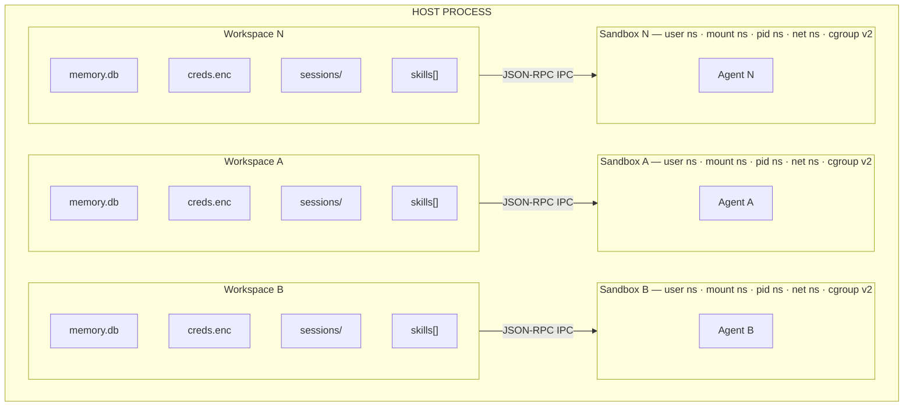
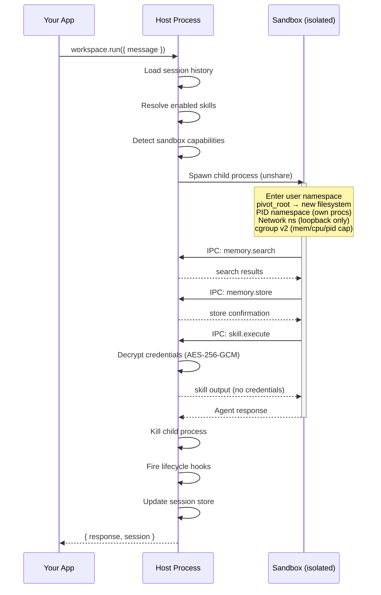
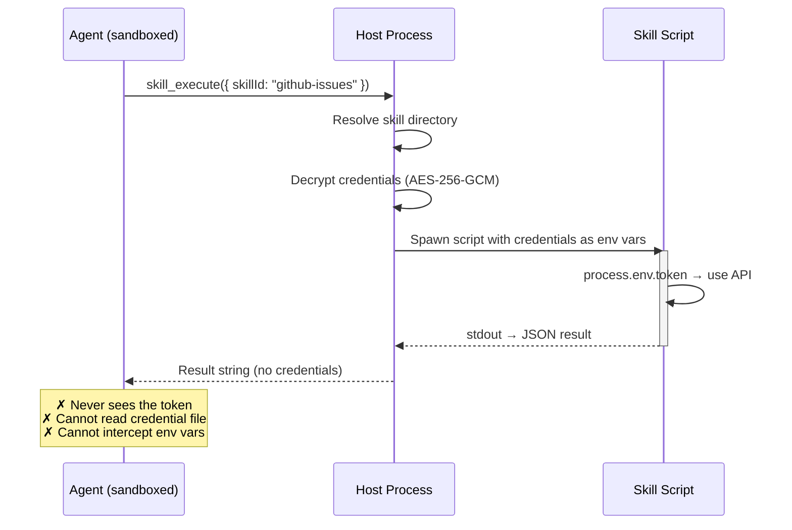
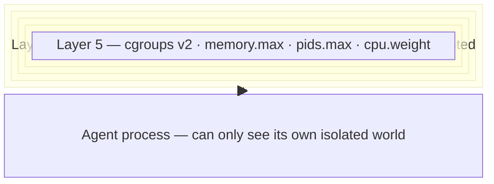

<p align="center">
  <br />
  
  <br /><br />
  <strong>Watertight isolation for multi-tenant AI agents.</strong>
  <br /><br />
  <a href="https://www.npmjs.com/package/bulkhead-runtime"></a>
  
  
  
  
  
  
</p>

<br />

<p align="center">
  Run 1,000 AI agents on a single Linux box.<br />
  Each in its own OS namespace. Each with private memory, encrypted credentials, and an isolated filesystem.<br />
  <b>No Docker. No cloud. One <code>npm install</code>.</b>
</p>

<br />

---

## Quick Start

```bash
npm install bulkhead-runtime
```

```typescript
import { createPlatform } from "bulkhead-runtime";

const platform = createPlatform({
  stateDir: "/var/bulkhead-runtime",
  credentialPassphrase: process.env.CREDENTIAL_KEY,
});

// Create isolated workspaces — one per user, team, or tenant
const workspace = await platform.createWorkspace("user-42", {
  provider: "anthropic",
  model: "claude-sonnet-4-20250514",
});

const result = await workspace.run({
  message: "Refactor the auth module to use JWT",
  sessionId: "project-alpha",
});
// Runs in a Linux namespace sandbox.
// Private memory, encrypted credentials, isolated filesystem.
// No other workspace can see this agent's data. Ever.
```

> **Requires:** Linux + Node.js 22.12+
>
> **macOS / Windows dev:**
> ```bash
> git clone https://github.com/tonga54/bulkhead-runtime.git && cd bulkhead-runtime
> docker compose run dev bash
> pnpm test  # 88 tests, all green
> ```

---

## Use Cases

<table>
<tr>
<td width="50%">

**One agent per customer in your SaaS**

Your platform gives each customer an AI agent. Each agent accesses that customer's repos, APIs, and databases — with their own credentials. Customer A's agent can never see Customer B's tokens, data, or conversation history.

```typescript
app.post("/api/agent", async (req, res) => {
  const ws = await platform.getWorkspace(req.org.id);
  const result = await ws.run({
    message: req.body.message,
    sessionId: req.body.threadId,
  });
  res.json({ response: result.response });
});
```

</td>
<td width="50%">

**Per-team agents inside your company**

Engineering, ops, and data each get their own agent. Each team's agent connects to their own tools — different GitHub orgs, different databases, different cloud accounts. No credential leaks between teams.

```typescript
const eng  = await platform.createWorkspace("engineering");
const ops  = await platform.createWorkspace("ops");
const data = await platform.createWorkspace("data-team");

eng.skills.enable("github-pr");
ops.skills.enable("pagerduty");
data.skills.enable("bigquery");

await eng.credentials.store("github", { token: "ghp_eng..." });
await ops.credentials.store("pagerduty", { token: "pd_..." });
await data.credentials.store("gcp", { key: "..." });
```

</td>
</tr>
<tr>
<td width="50%">

**Client-isolated agents in consulting / agencies**

Each client project gets its own workspace. The agent knows that client's stack, their conventions, their infra. When you offboard a client, `deleteWorkspace()` wipes everything — memory, credentials, sessions.

```typescript
const acme = await platform.createWorkspace("client-acme");
await acme.credentials.store("aws", { key: "...", secret: "..." });
await acme.credentials.store("jira", { token: "..." });

await acme.run({
  message: "Check the staging deploy and open a Jira ticket if it failed",
  sessionId: "daily-ops",
});

// Client offboarded — clean removal
await platform.deleteWorkspace("client-acme");
```

</td>
<td width="50%">

**Ephemeral agents for CI / PR review / task runners**

Spin up a workspace per job, per PR, or per deploy. The agent runs, does its thing, and the workspace is destroyed. No state leaks between runs.

```typescript
const jobId = `deploy-${Date.now()}`;
const ws = await platform.createWorkspace(jobId);

await ws.credentials.store("k8s", { kubeconfig: "..." });
ws.skills.enable("kubectl");

const result = await ws.run({
  message: "Roll out v2.3.1 to staging, run smoke tests, report status",
});

await platform.deleteWorkspace(jobId);
```

</td>
</tr>
</table>

**The common thread:** you have multiple tenants (users, teams, clients, jobs) and each one needs an AI agent with its own secrets, tools, and memory — on the same server, without any cross-contamination.

---

## How It Works



> Agent A cannot see Agent B's files, memory, credentials, or processes. Not by policy. **By kernel enforcement.**

---

## Why Bulkhead Over Alternatives

| | Docker per user | E2B / Cloud | **Bulkhead Runtime** |
|:---|:---:|:---:|:---:|
| **Isolation mechanism** | Container per user | Cloud VM per session | **Linux namespaces** |
| **Credential security** | DIY | Not built-in | **AES-256-GCM, never exposed to agent** |
| **Persistent memory** | DIY | DIY | **SQLite + vector embeddings per tenant** |
| **Skills with secret injection** | DIY | DIY | **Credentials injected server-side** |
| **Per-workspace skill config** | DIY | DIY | **Enable/disable per tenant** |
| **Infrastructure** | Docker daemon | Cloud API + billing | **Single npm package** |
| **Cold start** | ~2s | ~5-10s | **~50ms** |
| **Embeddable in your app** | No | No | **Yes — it's a library** |
| **License** | — | Proprietary | **MIT** |

---

## Single-User Mode

The fastest path for prototyping or single-agent use. No platform needed.

```typescript
import { createRuntime } from "bulkhead-runtime";

const runtime = await createRuntime({
  provider: "anthropic",
  model: "claude-sonnet-4-20250514",
});

const result = await runtime.run({
  message: "Find all TODO comments and create a summary",
});
```

The agent runs inside a Linux namespace sandbox with full coding tools (read, write, edit, bash, grep, find, ls) and autonomous memory (`memory_store`, `memory_search`).

---

## Multi-Tenant Isolation

This is the core of Bulkhead Runtime. Each user gets a **workspace** — a fully isolated environment with its own memory, encrypted credentials, enabled skills, and session history. Workspaces are physically separated at the OS level.

```typescript
import { createPlatform } from "bulkhead-runtime";

const platform = createPlatform({
  stateDir: "/var/bulkhead-runtime",
  credentialPassphrase: process.env.CREDENTIAL_KEY,
});

// Each workspace is a universe unto itself
const alice = await platform.createWorkspace("alice", {
  provider: "anthropic",
  model: "claude-sonnet-4-20250514",
});

const bob = await platform.createWorkspace("bob", {
  provider: "google",
  model: "gemini-2.5-flash",
});
```

### What "isolated" actually means

When `workspace.run()` executes, Bulkhead spawns a **child process** with 5 layers of kernel isolation. The agent **never runs in your application's process**.



The agent gets coding tools (bash, file read/write/edit) because the mount namespace restricts its entire filesystem view. **It literally cannot see anything outside its sandbox.**

---

## Credential Security

Credentials are **AES-256-GCM encrypted** at rest. PBKDF2 key derivation with 100k iterations (SHA-512). The agent **never** sees raw secrets — not through tools, not through IPC, not through environment variables.

```typescript
// Store encrypted credentials for Alice
await alice.credentials.store("github", { token: "ghp_alice_secret" });
await alice.credentials.store("openai", { apiKey: "sk-..." });

// When the agent uses a skill that needs credentials:
// 1. Host decrypts credentials server-side
// 2. Injects them as env vars into the skill process
// 3. Agent receives the skill's output — never the credential itself
```



System environment variables (`PATH`, `HOME`, `NODE_ENV`) are protected from credential key collision. Skill IDs are validated against prototype pollution.

---

## Per-Workspace Skills

Skills are registered globally and **enabled per workspace**. Each workspace gets exactly the capabilities it needs — nothing more.

```typescript
// Register skills globally
// skills/
//   github-issues/
//     SKILL.md         ← LLM reads this to understand the skill
//     execute.js       ← Runs with credentials injected as env vars
//   db-migration/
//     SKILL.md
//     execute.sh

// Enable different skills per workspace
const frontend = await platform.createWorkspace("team-frontend");
const backend  = await platform.createWorkspace("team-backend");

frontend.skills.enable("github-issues");
backend.skills.enable("github-issues");
backend.skills.enable("db-migration");   // only backend gets this

// Store different credentials per workspace
await frontend.credentials.store("github", { token: "ghp_frontend_token" });
await backend.credentials.store("github", { token: "ghp_backend_token" });
await backend.credentials.store("database", { url: "postgres://prod:5432/app" });
```

```javascript
// skills/github-issues/execute.js
const params = JSON.parse(await readStdin());
const token = process.env.token;  // Injected from encrypted store — never over IPC
const res = await fetch(`https://api.github.com/repos/${params.repo}/issues`, {
  headers: { Authorization: `Bearer ${token}` },
});
console.log(JSON.stringify(await res.json()));
```

Skills run with a minimal env (`PATH`, `HOME`, `NODE_ENV` + credentials), 30s timeout, and 10 MB stdout/stderr cap.

---

## Memory Isolation

Each workspace has its own SQLite database. Memories never cross workspace boundaries — not by access control, **by physical separation**.

```typescript
await alice.memory.store("Project uses React and TypeScript");
await bob.memory.store("Project uses Vue and Python");

const search = await alice.memory.search("framework");
// → "React and TypeScript"
// Bob's data doesn't exist in Alice's universe.
```

### Autonomous Agent Memory

The agent decides what to remember. Memory persists across sessions, across restarts.

```typescript
// Session 1
await runtime.run({
  message: "My name is Juan, I work in fintech, I prefer TypeScript",
  sessionId: "onboarding",
});

// Session 2 — different session, memory persists
await runtime.run({
  message: "Set up a new project for me",
  sessionId: "new-project",
});
// Agent searches memory → finds preferences → scaffolds TypeScript project
```

**Search engine under the hood:**

| Stage | Algorithm |
|:---|:---|
| **Vector search** | Cosine similarity against stored embeddings |
| **Keyword search** | SQLite FTS5 with BM25 ranking |
| **Fusion** | Weighted merge of vector + keyword scores |
| **Temporal decay** | Exponential time-based score attenuation |
| **Diversity** | MMR (Maximal Marginal Relevance) re-ranking |
| **Query expansion** | 7-language keyword extraction (EN/ES/PT/ZH/JA/KO/AR) |

Works without any embedding API key — falls back to FTS5 keyword search.

---

## Session Continuity

```typescript
await workspace.run({
  message: "Create a REST API for user management",
  sessionId: "api-project",
});

// Later — agent sees the full conversation history
await workspace.run({
  message: "Add input validation to those endpoints",
  sessionId: "api-project",
});
```

Sessions are per-workspace, stored as JSONL transcripts with async locking.

---

## Subagent Orchestration

A tool can spawn a child agent. The parent blocks until the child finishes.

```typescript
const result = await runtime.run({
  message: "Review this PR for security and performance",
  tools: [{
    name: "specialist",
    description: "Delegate a subtask to a specialist agent",
    parameters: { task: { type: "string" }, role: { type: "string" } },
    async execute(_id, params) {
      const r = await runtime.run({
        message: params.task,
        systemPrompt: `You are a ${params.role} expert.`,
      });
      return { resultForAssistant: r.response };
    },
  }],
});
```

---

## Lifecycle Hooks

```typescript
workspace.hooks.register("before_tool_call", async ({ toolName, input }) => {
  await auditLog.write({ tool: toolName, input, timestamp: Date.now() });
});

workspace.hooks.register("after_agent_end", async ({ sessionId, result }) => {
  await billing.recordUsage(workspace.id, sessionId);
});
```

6 hook points: `session_start` · `session_end` · `before_agent_start` · `after_agent_end` · `before_tool_call` · `after_tool_call`

---

## Security Architecture

### 5 Layers of Sandbox Isolation

All layers are **fail-closed** — if any layer can't be applied, the sandbox refuses to start.



### Defense in Depth

| Defense | Mechanism |
|:---|:---|
| **Env allowlist** | Only `PATH`, `HOME`, `NODE_ENV` + the single API key the agent needs. Everything else dropped. |
| **Credential proxy** | Secrets decrypted server-side, injected into skill execution. Never sent over IPC. |
| **Path traversal blocklist** | `/proc`, `/sys`, `/home/`, `/etc/shadow`, `/run/docker.sock`, and more are blocked from bind mounts. |
| **Symlink rejection** | `additionalBinds` sources must not be symlinks (prevents TOCTOU attacks). |
| **IPC rate limiting** | 200 calls/sec per method. Prevents resource exhaustion from rogue agents. |
| **IPC buffer limit** | 50 MB max. Peer stops on overflow to prevent memory exhaustion. |
| **Prototype pollution guard** | `__proto__`, `constructor`, `prototype` rejected as skill/credential IDs. |
| **Stdout interception** | IPC uses a dedicated fd. All other stdout is redirected to stderr. |
| **Sensitive path validation** | `workspaceDir`, `projectDir`, `nodeExecutable`, `additionalBinds` all validated. |
| **Atomic writes** | Config, credentials, sessions, skill state — all use tmp+rename pattern. |

---

## Provider Support

### LLM Providers

Any provider supported by [pi-ai](https://github.com/nicepkg/pi-ai):

| Provider | Example Model |
|:---|:---|
| **Anthropic** | `claude-sonnet-4-20250514` |
| **Google** | `gemini-2.5-flash` |
| **OpenAI** | `gpt-4o` |
| **Groq** | `llama-3.3-70b-versatile` |
| **Cerebras** | `llama-3.3-70b` |
| **Mistral** | `mistral-large-latest` |
| **xAI** | `grok-3` |

### Embedding Providers

Optional — keyword search works without any API key.

| Provider | Default Model | Local |
|:---|:---|:---:|
| **OpenAI** | `text-embedding-3-small` | |
| **Gemini** | `gemini-embedding-001` | |
| **Voyage** | `voyage-3-lite` | |
| **Mistral** | `mistral-embed` | |
| **Ollama** | `nomic-embed-text` | **Yes** |

---

## Architecture

```
src/
├── platform/          createPlatform() — workspace CRUD, skill registry
├── workspace/         createWorkspace() — scoped memory, sessions, runner
│   └── runner.ts      Out-of-process agent execution via sandbox + IPC
├── sandbox/           Linux namespace sandbox — zero external deps
│   ├── namespace.ts       unshare(2) + pivot_root
│   ├── cgroup.ts          cgroups v2 resource limits (fail-closed)
│   ├── rootfs.ts          Minimal rootfs with bind mounts
│   ├── ipc.ts             Bidirectional JSON-RPC 2.0 over stdio
│   ├── seccomp.ts         BPF syscall filter profiles (prepared)
│   ├── proxy-tools.ts     memory/skill tools proxied to host via IPC
│   └── worker.ts          Agent entry point inside sandbox
├── credentials/       AES-256-GCM encrypted store + credential proxy
├── skills/            Global registry + per-workspace enablement
├── runtime/           createRuntime() — single-user mode
├── memory/            Hybrid search engine
│   ├── hybrid.ts          Vector + FTS5 fusion scoring
│   ├── mmr.ts             Maximal Marginal Relevance re-ranking
│   ├── temporal-decay.ts  Exponential time-based scoring
│   └── query-expansion.ts 7-language keyword expansion
├── hooks/             6 lifecycle hook points
├── sessions/          File-based store with async locking
└── config/            Configuration loading
```

**59 source files** · **3 runtime deps** · Sandbox, crypto, and IPC use **zero external deps** — all Node.js built-ins.

---

## State Directory

```
<stateDir>/
├── skills/                          # Global skill catalog
│   └── <skill-id>/
│       ├── SKILL.md                 # LLM-readable skill description
│       └── execute.js               # Runs with injected credentials
└── workspaces/
    └── <userId>/
        ├── config.json              # Workspace config (no secrets)
        ├── credentials.enc.json     # AES-256-GCM encrypted credentials
        ├── enabled-skills.json      # Which skills this workspace can use
        ├── sessions.json            # Session index
        ├── sessions/                # JSONL transcripts
        └── memory/
            └── memory.db            # SQLite (vectors + FTS5)
```

Every file is workspace-scoped. No shared state between tenants.

---

## Requirements

- **Linux** — bare metal, VM, or container with `--privileged`
- **Node.js 22.12+** — uses `node:sqlite` built-in
- **macOS / Windows** — `docker compose run dev` for development

## License

[MIT](LICENSE)
