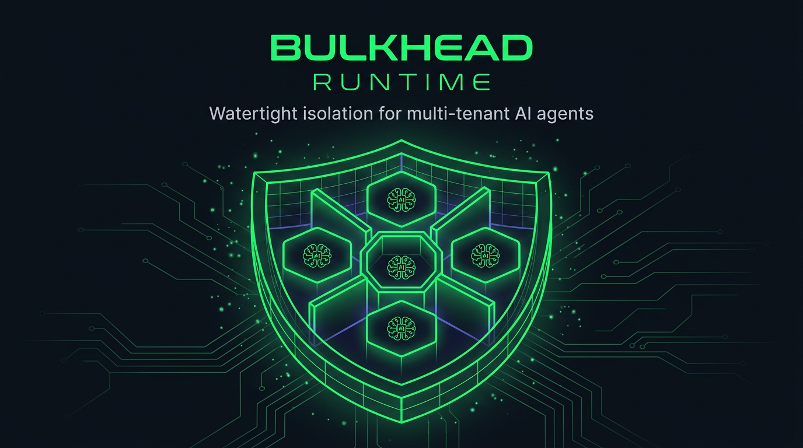
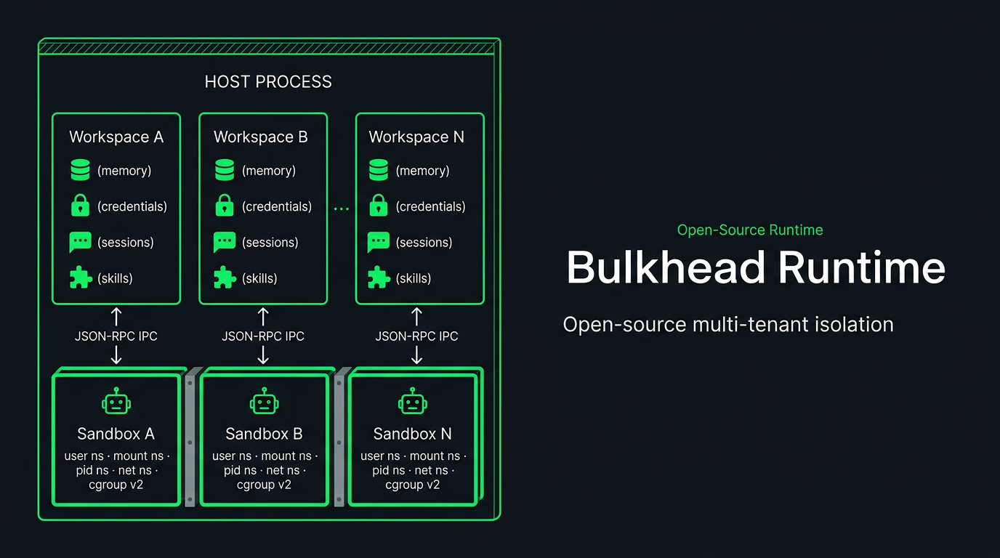

[](https://www.npmjs.com/package/bulkhead-runtime)      

**Run 1,000 AI agents on a single Linux box.**
Each in its own OS namespace. Each with private memory, encrypted credentials, and an isolated filesystem.
**No Docker. No cloud. One `npm install`.**

Built on battle-tested subsystems extracted from [OpenClaw](https://github.com/nicepkg/openclaw) — model fallback, error classification, API key rotation, SSRF protection, embedding pipeline, and more.

---

## Quick Start

```bash
npm install bulkhead-runtime
```

```typescript
import { createPlatform } from "bulkhead-runtime";

const platform = createPlatform({
  stateDir: "/var/bulkhead-runtime",
  credentialPassphrase: process.env.BULKHEAD_CREDENTIAL_KEY,
});

const workspace = await platform.createWorkspace("user-42", {
  provider: "anthropic",
  model: "claude-sonnet-4-20250514",
});

const result = await workspace.run({
  message: "Refactor the auth module to use JWT",
  sessionId: "project-alpha",
});
```

> **Requires:** Linux + Node.js 22.12+
>
> **macOS / Windows dev:**
>
> ```bash
> git clone https://github.com/tonga54/bulkhead-runtime.git && cd bulkhead-runtime
> docker compose run dev bash
> pnpm test  # 279 tests, all green
> ```

---

## Use Cases


### SaaS -- one agent per customer

Customer A's agent can never see Customer B's tokens, data, or conversation history.

```typescript
app.post("/api/agent", async (req, res) => {
  const ws = await platform.getWorkspace(req.org.id);
  const result = await ws.run({
    message: req.body.message,
    sessionId: req.body.threadId,
  });
  res.json({ response: result.response });
});
```

### Teams -- per-team agents, per-team secrets

Different teams, different databases, different cloud accounts. No credential leaks.

```typescript
const eng = await platform.createWorkspace("engineering");
const ops = await platform.createWorkspace("ops");

eng.skills.enable("github-pr");
ops.skills.enable("pagerduty");

await eng.credentials.store("github", { token: "ghp_eng..." });
await ops.credentials.store("pagerduty", { token: "pd_..." });
```

### CI/CD -- ephemeral agents, zero state leaks

Spin up per job, per PR, per deploy. Destroyed after.

```typescript
const ws = await platform.createWorkspace(`deploy-${Date.now()}`);
await ws.credentials.store("k8s", { kubeconfig: "..." });
ws.skills.enable("kubectl");
const result = await ws.run({ message: "Roll out v2.3.1 to staging, run smoke tests" });
await platform.deleteWorkspace(ws.userId);
```

---

## How It Works



When `workspace.run()` executes, Bulkhead spawns a **child process** with 5 layers of kernel isolation: user namespace, PID namespace, mount namespace (pivot_root), optional network namespace, and cgroups v2 resource limits. The agent **never runs in your application's process** and **cannot see anything outside its sandbox**.

> **[Read the full isolation architecture &rarr;](docs/isolation.md)**

---

## Single-User Mode

For prototyping or single-agent use. No platform needed.

```typescript
import { createRuntime } from "bulkhead-runtime";

const runtime = await createRuntime({
  provider: "anthropic",
  model: "claude-sonnet-4-20250514",
});

const result = await runtime.run({
  message: "Find all TODO comments and create a summary",
});
```

---

## Features

| Feature | What It Does | Docs |
|---------|-------------|------|
| **OS-level Isolation** | 5 layers: user, PID, mount, network namespaces + cgroups v2 | [docs/isolation.md](docs/isolation.md) |
| **Encrypted Credentials** | AES-256-GCM at rest, PBKDF2 key derivation, never exposed to agent | [docs/credentials.md](docs/credentials.md) |
| **Hybrid Memory** | Vector + FTS5 fusion, MMR diversity, temporal decay, 7-language query expansion | [docs/memory.md](docs/memory.md) |
| **Per-Workspace Skills** | Global registry, per-tenant enablement, credentials injected server-side | [docs/skills.md](docs/skills.md) |
| **Session Continuity** | Named sessions, JSONL transcripts, context pruning | [docs/sessions.md](docs/sessions.md) |
| **Model Fallback** | Automatic multi-model chains, error classification, cooldown tracking | [docs/fallback.md](docs/fallback.md) |
| **API Key Rotation** | Multi-key per provider, automatic rotation on rate limits | [docs/fallback.md](docs/fallback.md) |
| **Subagent Orchestration** | Parallel execution, depth limiting, registry | [docs/subagents.md](docs/subagents.md) |
| **Structured Logging** | JSON/pretty/compact, file output, subsystem tagging | [docs/logging.md](docs/logging.md) |
| **SSRF Protection** | DNS pinning, private IP blocking, hostname allowlists, fail-closed | [docs/memory.md](docs/memory.md) |
| **Embedding Pipeline** | Batch with retry, SQLite cache, 5 providers (including local Ollama) | [docs/memory.md](docs/memory.md) |

---

## Why Bulkhead Over Alternatives

|                                  | Docker per user    | E2B / Cloud          | **Bulkhead Runtime**                         |
| -------------------------------- | ------------------ | -------------------- | -------------------------------------------- |
| **Isolation mechanism**          | Container per user | Cloud VM per session | **Linux namespaces**                         |
| **Credential security**          | DIY                | Not built-in         | **AES-256-GCM, never exposed to agent**      |
| **Persistent memory**            | DIY                | DIY                  | **SQLite + vector embeddings per tenant**    |
| **SSRF protection**              | DIY                | DIY                  | **DNS-validated, private-IP blocking**       |
| **Model fallback**               | DIY                | DIY                  | **Automatic multi-model fallback chains**    |
| **API key rotation**             | DIY                | DIY                  | **Multi-key with rate-limit rotation**       |
| **Skills with secret injection** | DIY                | DIY                  | **Credentials injected server-side**         |
| **Infrastructure**               | Docker daemon      | Cloud API + billing  | **Single npm package**                       |
| **Cold start**                   | ~2s                | ~5-10s               | **~50ms**                                    |
| **Embeddable in your app**       | No                 | No                   | **Yes — it's a library**                     |
| **License**                      | —                  | Proprietary          | **MIT**                                      |

---

## Provider Support

### LLM Providers

Any provider supported by [pi-ai](https://github.com/nicepkg/pi-ai):

| Provider | Example Model |
|----------|---------------|
| **Anthropic** | `claude-sonnet-4-20250514` |
| **Google** | `gemini-2.5-flash` |
| **OpenAI** | `gpt-4o` |
| **Groq** | `llama-3.3-70b-versatile` |
| **Cerebras** | `llama-3.3-70b` |
| **Mistral** | `mistral-large-latest` |
| **xAI** | `grok-3` |

### Embedding Providers

| Provider | Default Model | Local |
|----------|--------------|-------|
| **OpenAI** | `text-embedding-3-small` | |
| **Gemini** | `gemini-embedding-001` | |
| **Voyage** | `voyage-3-lite` | |
| **Mistral** | `mistral-embed` | |
| **Ollama** | `nomic-embed-text` | **Yes** |

---

## Lifecycle Hooks

6 hook points for audit logging, billing, and custom logic:

```typescript
workspace.hooks.register("before_tool_call", async ({ toolName, input }) => {
  await auditLog.write({ tool: toolName, input, timestamp: Date.now() });
});

workspace.hooks.register("after_agent_end", async ({ sessionId, result }) => {
  await billing.recordUsage(workspace.userId, sessionId);
});
```

`session_start` · `session_end` · `before_agent_start` · `after_agent_end` · `before_tool_call` · `after_tool_call`

---

## Demos

12 runnable demos covering every feature. 4 require an API key, 8 run fully local.

> **[See all demos &rarr;](docs/demos.md)**

Highlights:

- **[demo-workspace-real](demos/demo-workspace-real.ts)** — Full multi-tenant DevOps platform with 2 teams, skills, memory, credentials, and live agent execution
- **[demo-subagents](demos/demo-subagents.ts)** — Orchestrator delegates to specialist sub-agents
- **[demo-fallback](demos/demo-fallback.ts)** — Model fallback chains with simulated failures

---

## Architecture

```
src/
├── platform/          createPlatform() — workspace CRUD, skill registry
├── workspace/         createWorkspace() — scoped memory, sessions, runner
│   └── runner.ts      Out-of-process agent execution via sandbox + IPC
├── sandbox/           Linux namespace sandbox — zero external deps
│   ├── namespace.ts       unshare(2) + pivot_root
│   ├── cgroup.ts          cgroups v2 resource limits (fail-closed)
│   ├── rootfs.ts          Minimal rootfs with bind mounts
│   ├── ipc.ts             Bidirectional JSON-RPC 2.0 over stdio
│   ├── seccomp.ts         BPF syscall filter profiles
│   ├── proxy-tools.ts     memory/skill tools proxied to host via IPC
│   └── worker.ts          Agent entry point inside sandbox
├── credentials/       AES-256-GCM encrypted store + credential proxy
├── skills/            Global registry + per-workspace enablement
├── runtime/           createRuntime() — single-user mode
│   ├── failover-error.ts   Error classification (ported from OpenClaw)
│   ├── model-fallback.ts   Fallback chains + cooldown tracking
│   ├── api-key-rotation.ts Per-provider key rotation
│   ├── subagent.ts         Parallel execution + lifecycle + registry
│   └── ...                 context-guard, retry, session-pruning, memory-flush
├── memory/            Hybrid search engine
│   ├── hybrid.ts          Vector + FTS5 fusion scoring
│   ├── mmr.ts             Maximal Marginal Relevance re-ranking
│   ├── embeddings.ts      5-provider embedding support
│   ├── ssrf.ts            SSRF protection for HTTP calls
│   └── ...                temporal-decay, query-expansion, cache, indexers
├── hooks/             6 lifecycle hook points
├── logging/           Structured JSON logging with file output
├── sessions/          File-based store with async locking
└── config/            Configuration loading
```

**78 source files** · **3 runtime deps** · Sandbox, crypto, IPC, logging, and SSRF use **zero external deps** — all Node.js built-ins.

---

## State Directory

```
<stateDir>/
├── skills/                          # Global skill catalog
│   └── <skill-id>/
│       ├── SKILL.md                 # LLM-readable skill description
│       └── execute.js               # Runs with injected credentials
└── workspaces/
    └── <userId>/
        ├── config.json              # Workspace config (no secrets)
        ├── credentials.enc.json     # AES-256-GCM encrypted credentials
        ├── enabled-skills.json      # Which skills this workspace can use
        ├── sessions.json            # Session index
        ├── sessions/                # JSONL transcripts
        └── memory/
            └── memory.db            # SQLite (vectors + FTS5)
```

Every file is workspace-scoped. No shared state between tenants.

---

## Built on OpenClaw

Bulkhead Runtime stands on the shoulders of [OpenClaw](https://github.com/nicepkg/openclaw). Several production-critical subsystems were ported directly:

| Subsystem | Origin |
|-----------|--------|
| **Model fallback & error classification** | `src/agents/model-fallback.ts`, `failover-error.ts` |
| **API key rotation** | `src/agents/api-key-rotation.ts`, `live-auth-keys.ts` |
| **Context window guards** | `src/agents/context-window-guard.ts` |
| **Retry with backoff** | `src/infra/retry.ts` |
| **SSRF protection** | `src/infra/net/ssrf.ts`, `fetch-guard.ts` |
| **Embedding cache & batch** | `extensions/memory-core/` |
| **File & session indexers** | `extensions/memory-core/` |
| **Subagent orchestration** | `src/agents/subagent-*.ts` |
| **Structured logging** | `src/logging/logger.ts`, `subsystem.ts` |

OpenClaw solved these problems in production. We extracted, adapted, and integrated them into Bulkhead's multi-tenant architecture.

---

## Requirements

- **Linux** — bare metal, VM, or container with `--privileged`
- **Node.js 22.12+** — uses `node:sqlite` built-in
- **macOS / Windows** — `docker compose run dev` for development

## License

[MIT](LICENSE)
