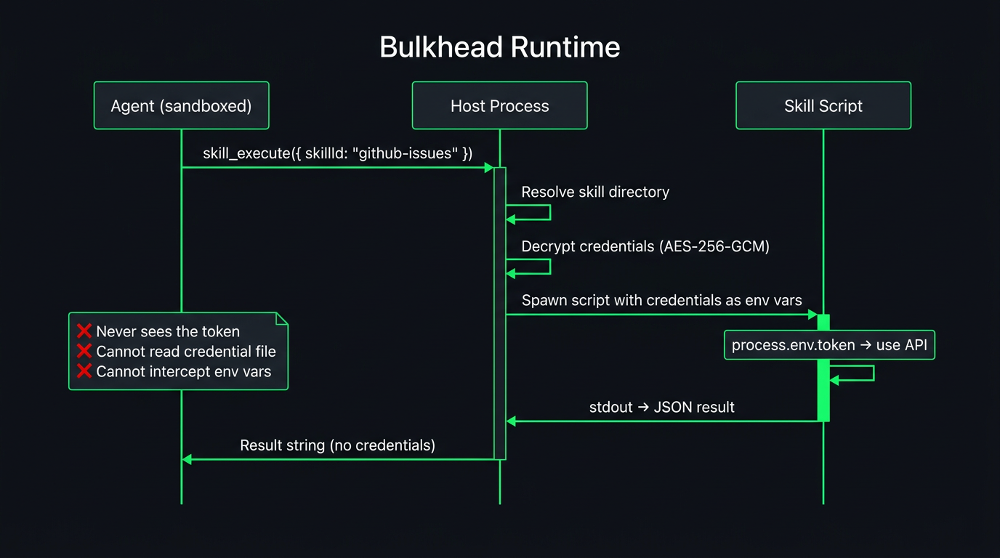

# Credential Security

Credentials are **AES-256-GCM encrypted** at rest. PBKDF2 key derivation with 100k iterations (SHA-512). The agent **never** sees raw secrets — not through tools, not through IPC, not through environment variables.

## Storing Credentials

```typescript
await workspace.credentials.store("github", { token: "ghp_secret" });
await workspace.credentials.store("openai", { apiKey: "sk-..." });
await workspace.credentials.store("stripe", { apiKey: "sk_live_...", webhookSecret: "whsec_..." });
```

Each credential entry is stored as:

```json
{
  "salt": "...",
  "iv": "...",
  "tag": "...",
  "ciphertext": "..."
}
```

Raw values are never written to disk.

## Credential Proxy



When a skill executes, credentials are decrypted **server-side** and injected into the skill process environment. The agent itself never has access to the decryption key or raw credential values.

```
Agent (sandboxed)                   Host Process
   │                                    │
   ├─ skill.execute("github") ─────────►│
   │                                    ├─ Decrypt credentials for "github"
   │                                    ├─ Spawn skill process with:
   │                                    │     env.token = "ghp_secret"
   │                                    │     env.PATH = (system)
   │                                    │     env.HOME = (system)
   │                                    │     (nothing else)
   │                                    ├─ Execute skill script
   │◄─ skill result ───────────────────┤
```

## Environment Sanitization

System environment variables (`PATH`, `HOME`, `NODE_ENV`) are protected from credential key collision. Dangerous environment keys (`NODE_OPTIONS`, `LD_PRELOAD`, `BASH_ENV`, etc.) are blocked from credential injection.

## Configuration

The encryption passphrase is set once per platform:

```typescript
const platform = createPlatform({
  stateDir: "/var/bulkhead-runtime",
  credentialPassphrase: process.env.BULKHEAD_CREDENTIAL_KEY,
});
```

Or per workspace:

```typescript
const workspace = await platform.createWorkspace("user-42", {
  credentialPassphrase: "per-tenant-key",
});
```

## Source Files

- `src/credentials/store.ts` — AES-256-GCM encrypted store
- `src/credentials/proxy.ts` — Credential proxy for skill execution
- `src/credentials/types.ts` — Type definitions
