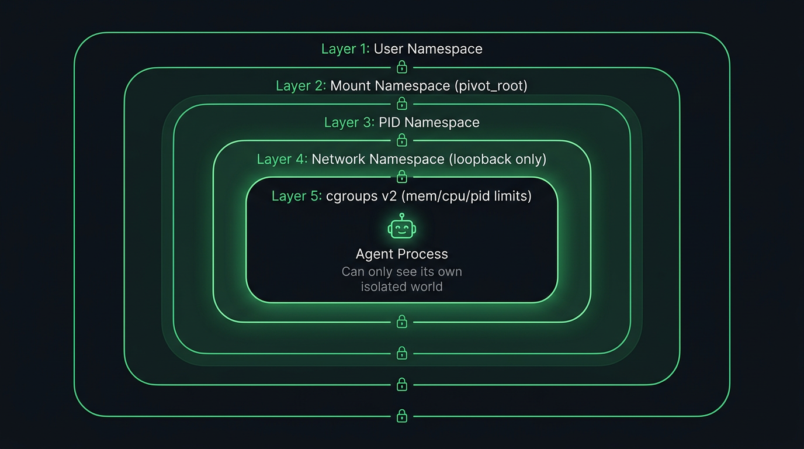
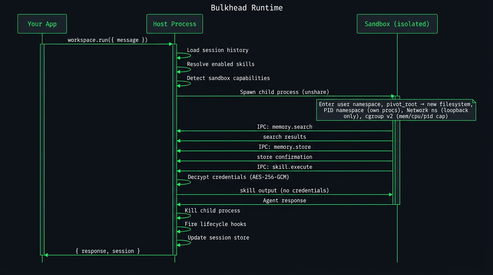

# Sandbox & Isolation

Bulkhead Runtime enforces tenant isolation at the **kernel level** using Linux namespaces. When `workspace.run()` executes, the agent runs in a child process with 5 layers of OS isolation. It never runs in your application's process.

## 5 Layers of Sandbox Isolation



All layers are **fail-closed** — if any layer can't be applied, the sandbox refuses to start.


| Layer                 | Mechanism                  | What It Does                                               |
| --------------------- | -------------------------- | ---------------------------------------------------------- |
| **User namespace**    | `unshare --user`           | Agent runs as unprivileged user, even if host runs as root |
| **PID namespace**     | `unshare --pid`            | Agent can only see its own processes                       |
| **Mount namespace**   | `pivot_root`               | Agent gets an isolated filesystem — cannot see host files  |
| **Network namespace** | `unshare --net` (optional) | Agent has no network access unless explicitly allowed      |
| **cgroups v2**        | Memory, CPU, PIDs          | Hard resource limits prevent runaway agents                |


## Defense in Depth


| Defense                       | Mechanism                                                                                            |
| ----------------------------- | ---------------------------------------------------------------------------------------------------- |
| **Env allowlist**             | Only `PATH`, `HOME`, `NODE_ENV` + the single API key the agent needs. Everything else dropped.       |
| **Credential proxy**          | Secrets decrypted server-side, injected into skill execution. Never sent over IPC.                   |
| **Path traversal blocklist**  | `/proc`, `/sys`, `/home/`, `/etc/shadow`, `/run/docker.sock`, and more are blocked from bind mounts. |
| **Symlink rejection**         | `additionalBinds` sources must not be symlinks (prevents TOCTOU attacks).                            |
| **IPC rate limiting**         | 200 calls/sec per method. Prevents resource exhaustion from rogue agents.                            |
| **IPC buffer limit**          | 50 MB max. Peer stops on overflow to prevent memory exhaustion.                                      |
| **Prototype pollution guard** | `__proto__`, `constructor`, `prototype` rejected as skill/credential IDs.                            |
| **Stdout interception**       | IPC uses a dedicated fd. All other stdout is redirected to stderr.                                   |
| **Sensitive path validation** | `workspaceDir`, `projectDir`, `nodeExecutable`, `additionalBinds` all validated.                     |
| **Atomic writes**             | Config, credentials, sessions, skill state — all use tmp+rename pattern.                             |


## Execution Flow



```
Your App                          Bulkhead Runtime
   │                                    │
   ├─ workspace.run(message) ──────────►│
   │                                    ├─ Resolve model + API key
   │                                    ├─ Build sandbox config
   │                                    ├─ unshare (user, pid, mount)
   │                                    ├─ pivot_root to isolated rootfs
   │                                    ├─ Apply cgroup limits
   │                                    ├─ Spawn worker process
   │                                    │     ├─ createAgentSession()
   │                                    │     ├─ sendUserMessage()
   │                                    │     ├─ Tool calls via IPC ◄──►
   │                                    │     └─ Return response
   │                                    ├─ Kill sandbox
   │◄─ { response, sessionId } ────────┤
```

The agent gets coding tools (bash, file read/write/edit) because the mount namespace restricts its entire filesystem view. **It literally cannot see anything outside its sandbox.**

## Source Files

- `src/sandbox/namespace.ts` — `unshare(2)` + `pivot_root`
- `src/sandbox/cgroup.ts` — cgroups v2 resource limits (fail-closed)
- `src/sandbox/rootfs.ts` — Minimal rootfs with bind mounts
- `src/sandbox/seccomp.ts` — BPF syscall filter profiles
- `src/sandbox/ipc.ts` — Bidirectional JSON-RPC 2.0 over stdio
- `src/sandbox/worker.ts` — Agent entry point inside sandbox

